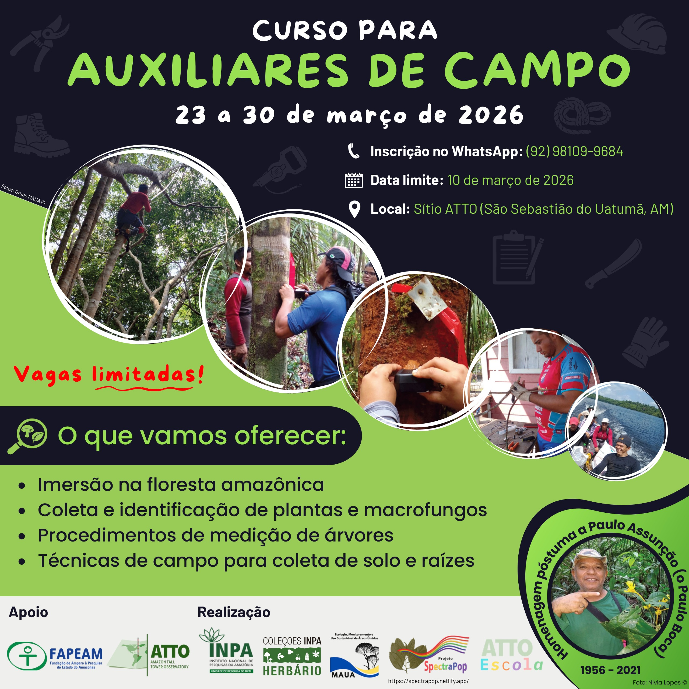
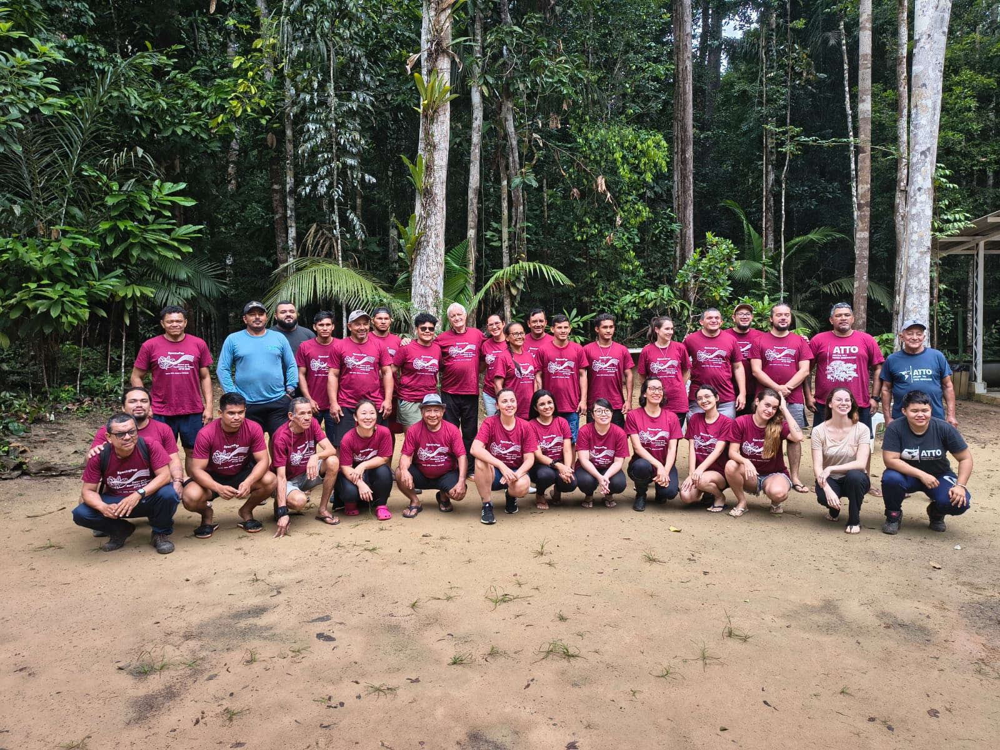

# Introduction

The course was developed within the [SpectraPop Project](../index.qmd),
with the aim of training field assistants to work in scientific research
in the Amazon, with a focus on safe practices, data organization and
botanical collecting. Held at the ATTO (Amazon Tall Tower Observatory)
site, the course combined theory and practice in a real forest
environment, giving participants an immersive experience of field
routines.

<figure style="text-align:center;">

{.slide style="display:block;"}

<figcaption style="font-size:0.9rem; color:#555; margin-top:6px;">

Promotional flyer for the training course for Field Assistants of the
SpectraPop Project.

</figcaption>

</figure>

# Course details

**Where:** ATTO Site – Amazon Tall Tower Observatory, Uatumã Sustainable
Development Reserve, São Sebastião do Uatumã, Amazonas, Brazil.

```{r echo=FALSE, message=FALSE, warning=FALSE}
library(leaflet)
leaflet() %>%
  addTiles %>% # Add default OpenStreetMap map tiles
  setView(lng = -59.003481, lat = -2.148550, zoom = 14)
```

**Date:** March 23–30, 2026.\

**Target audience:** Field assistants already working in the area and
technicians interested in working as field assistants in scientific
research in the Amazon, especially in botany, ecology and environmental
data collection.\

**Number of places offered:** 20 places.\

**Course load:** 66 h (a certificate of participation will be issued).\

**Format:** In person, with theoretical and practical activities carried
out in a forest environment. The course was structured as an intensive
program, with daily field routines, supervised practical activities and
lectures in the evening.

**Material:** Field equipment, materials for botanical collecting,
climbing gear, soil sampling instruments and supplies for sample
preservation were used. Instructions were given directly during the
practical activities.

# Schedule

## Overview

-   Participants received guidance on field safety, including moving
    along trails, use of equipment and conduct in a forest environment.
-   Principles of ethics in the collection of biological material were
    covered, respecting scientific and environmental regulations.
-   The activities involved an intense field routine, requiring physical
    fitness and adaptation to Amazonian conditions.

## Timeline

See the full program (PDF, in Portuguese):

<iframe src="../../assets/documents/cronograma.pdf" width="100%" height="600px">

</iframe>

# Team

## Organizing committee

 Dr. Flávia Machado Durgante
(MAUA/ATTO/INPA)
<a href="xxx" target="_blank"></a>

 Dr. Samyra Ramos Chaves
(MAUA/INPA)
<a href="xxx" target="_blank"></a>

 Dr. Caroline da Cruz
Vasconcelos (MAUA/INPA)
<a href="xxx" target="_blank"></a>

 MSc Kaio Cesar Marinho da Cunha
(MAUA/INPA)
<a href="xxx" target="_blank"></a>

 Roberta Pereira de Souza (ATTO)
<a href="xxx" target="_blank"></a>

## Science communicators

 Dr. Aline Radaelli Basso (ATTO)
<a href="xxx" target="_blank"></a>

 Luciano Lima Francisco
(MAUA/INPA)
<a href="xxx" target="_blank"></a>

## Lecturers

 Dr. Caroline da Cruz
Vasconcelos (MAUA/INPA)
<a href="xxx" target="_blank"></a>

 Dr. Dirce Leimi Komura (INPA)
<a href="xxx" target="_blank"></a>

 Dr. Flávia Machado Durgante
(MAUA/ATTO/INPA)
<a href="xxx" target="_blank"></a>

 MSc Francisco Alcinei Gomes da
Silva (ATTO)
<a href="xxx" target="_blank"></a>

 MSc Francisco Javier Farroñay
Pacaya (PDBFF/INPA)
<a href="xxx" target="_blank"></a>

 Dr. Layon Oreste Demarchi
(MAUA/INPA)
<a href="xxx" target="_blank"></a>

 Dr. Michael John Gilbert Hopkins
(INPA)
<a href="xxx" target="_blank"></a>

 Sipko Marten Bulthuis (ATTO)

 Dr. Vania Nobuko Yoshikawa
(INPA)
<a href="xxx" target="_blank"></a>

 MSc Yago Rodrigues Santos (ATTO)
<a href="xxx" target="_blank"></a>

## Assistant lecturers

 Alice Silva de Lima (INPA)
<a href="xxx" target="_blank"></a>

 MSc Kaio Cesar Marinho da Cunha
(MAUA/INPA)
<a href="xxx" target="_blank"></a>

 Dr. Samyra Ramos Chaves
(MAUA/INPA)
<a href="xxx" target="_blank"></a>

 MSc Rafaela Araujo Ferreira
Gurgel (MAUA/INPA)
<a href="xxx" target="_blank"></a>

## Trainers

 Francisco Marques Bezerra
(Field assistant)

 Jose Francisco Tenacol Andes Jr.
(Field assistant)

 Jose Raimundo Ferreira Nunes
(Field assistant/Climber)

 Ocirio de Souza Pereira
(Field assistant)

## Technical support

 André Luiz Matos (Head
cook, ATTO)

 Antonio Huxley Melo do
Nascimento (Logistics support, ATTO)

 Adi Vasconcelos Brandão
(Kitchen assistant, ATTO)

 Valmir Ferreira Lima (Logistics
support, ATTO)

 Keven Muniz de Lima (Logistics
support, ATTO)

# Funding

This course is part of the Project “Popularization of the use of the
Species Spectral Signature in the identification of trees in Sustainable
Forest Management in the Amazon - SPECTRA POP”, funded by the Amazonas
State Research Support Foundation (FAPEAM), Call No. 006/2024 - Mulher
Faz Ciência (Process No. 01.02.016301.04984/2024-17).

The course also had the institutional support of INPA and its related
initiatives and structures, including the ATTO Project, ATTO School, the
MAUA Group and Editora INPA. This institutional integration strengthened
the quality of the course, ensuring training aligned with excellent
scientific research and with the real demands of fieldwork in the
Amazon.

# Participants

<figure style="text-align:center;">

{.slide style="display:block;"}

<figcaption style="font-size:0.9rem; color:#555; margin-top:6px;">

Participants of the training course for Field Assistants of the
SpectraPop Project, held at the ATTO site, March 2026.

</figcaption>

</figure>
