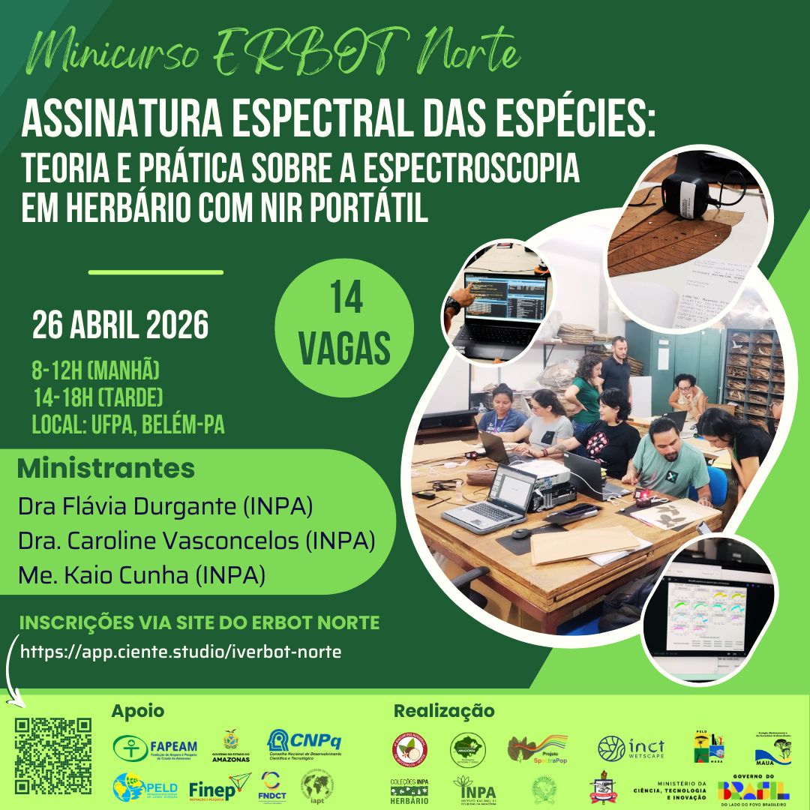
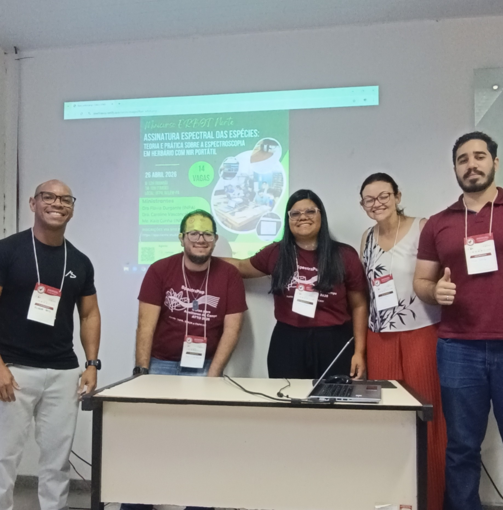

# Introduction

Welcome!😊

This course was designed to train students and professionals in the use
of portable near-infrared (NIR) spectrometers. Over the course of the
day, participants will explore the fundamentals of NIR spectroscopy and
its applications to plant identification in a herbarium context.

The main analytical workflows will also be covered, both in theory and
in practice, including spectra acquisition and quality control (for
demonstration purposes), curation of spectral data and analyses applied
to species discrimination.

<figure style="text-align:center;">

{.slide style="display:block;"}

<figcaption style="font-size:0.9rem; color:#555; margin-top:6px;">

Promotional flyer for the short course at ERBOT Norte 2026.

</figcaption>

</figure>

# Course details

**Where:** ICB, Federal University of Pará (UFPA), Av. Perimetral,
2-224 - 66077-830 - Guamá, Belém, Pará, Brazil.

```{r echo=FALSE, message=FALSE, warning=FALSE}
library(leaflet)
leaflet() %>%
  addTiles %>% # Add default OpenStreetMap map tiles
  setView(lng = -48.457588, lat = -1.473429, zoom = 17)
```

**Date:** April 26, 2026.\

**Target audience:** Students and professionals involved in the
herbarium/reference collection workflow who are interested in using
portable spectroscopy for scientific research.\

**Number of places:** 14 (in-person places).\

**Course load:** 7 h (certificate of participation to be issued by the
ERBOT Norte organizers).\

**Format:** In-person course, with the theoretical class streamed live
in a virtual environment and practical activities carried out in person.

**Material:** Slides and *scripts* will be made available directly to
participants or via [Download](../download.qmd).

# Schedule

## Overview

The course activities will take place all day, from 8:00 am to 12:00 pm,
with a lunch break, and from 2:00 pm to 5:00 pm (local time in Belém).

> ⚠️ **Note (lunch):**\
> As it is a Sunday, the UFPA restaurants will not be open.\
> The event organizers have arranged a meal for R\$ 17.00 per person
> (menu: mixed grill or breaded chicken fillet). Those interested should
> contact Jesiane \[link removed\], make the payment via PIX to this
> number and send the proof of payment.

## Timeline

### Morning (class given virtually by Flávia Durgante)

-   Fundamentals of near-infrared (NIR) spectroscopy
-   Applications in herbaria and species identification
-   Introduction to spectral analyses

Access to the class: <https://meet.jit.si/MinicursoERBOT2026>

Complementary material: Video – Tour of the Electromagnetic Spectrum
(NASA) <https://www.youtube.com/watch?v=2p7FPFvu_j0>

### Afternoon (class given by Caroline Vasconcelos and Kaio Cunha)

**Practical demonstration of the portable NIR**

-   Presentation of the NIR-S-G1 device (InnoSpectra Corp.), accessories
    and app\
-   Demonstration of spectra acquisition on herbarium specimens
    (reference samples)\

**Analyses in R**\
*(using a previously provided dataset —*
<https://doi.org/10.5281/zenodo.15531968>*)*

-   Installing and loading the required libraries\
-   Importing spectral data\
-   Visualizing and assessing the quality of the spectra\
-   Preparing the data for analysis\
-   Discriminant analysis (LDA) with Leave-One-Out (LOO)
    cross-validation\
-   Performance evaluation (accuracy and confusion matrix)

# Organizing and training team

 Prof. Dr. Flávia Durgante
(Coordinator of the SpectraPop/HerbSpectra-Amazônia Projects),
MAUA/ATTO/INPA
<a href="http://lattes.cnpq.br/9866263113578229" target="_blank"></a>

 Dr. Caroline Vasconcelos
(HerbSpectra-Amazônia Project fellow), MAUA/INPA
<a href="http://lattes.cnpq.br/1535461703335857" target="_blank"></a>

 MSc Kaio Cunha
(HerbSpectra-Amazônia Project fellow), MAUA/INPA
<a href="http://lattes.cnpq.br/2664299098538335" target="_blank"></a>

# Funding

This course is supported by the projects "Amazonian Spectral Herbaria
Network: Spectroscopy and artificial intelligence for the automated
identification of biodiversity in Amazonian herbaria -
HerbSpectra-Amazônia", funded by the National Council for Scientific and
Technological Development (CNPq), Public Call MCTI/CNPq No. 03/2025 -
Pró-Amazônia (process no. 385465/2025-4); "Building a near-infrared
spectral library to reveal new species of *Ecclinusa* (Sapotaceae,
Chrysophylloideae) in South America", funded by the International
Association for Plant Taxonomy (IAPT, 2025 round); and "Popularization
of the use of the Species Spectral Signature in the identification of
trees in Sustainable Forest Management in the Amazon - SPECTRA POP”,
funded by the Amazonas State Research Support Foundation (FAPEAM), Call
No. 006/2024 - Mulher Faz Ciência (Process No.
01.02.016301.04984/2024-17). The course is also supported by the INPA
Herbarium through the MCTI/FINEP/FNDCT Public Call No. 02/2016 –
National Multi-User Centers.

# Participants

<figure style="text-align:center;">

{.slide fig-align="right" style="display:block;"
width="100%"}

<figcaption style="font-size:0.9rem; color:#555; margin-top:6px;">

Participants of the Short Course at the 4th ERBOT Norte 2026 in Belém,
PA, April 2026

</figcaption>

</figure>
