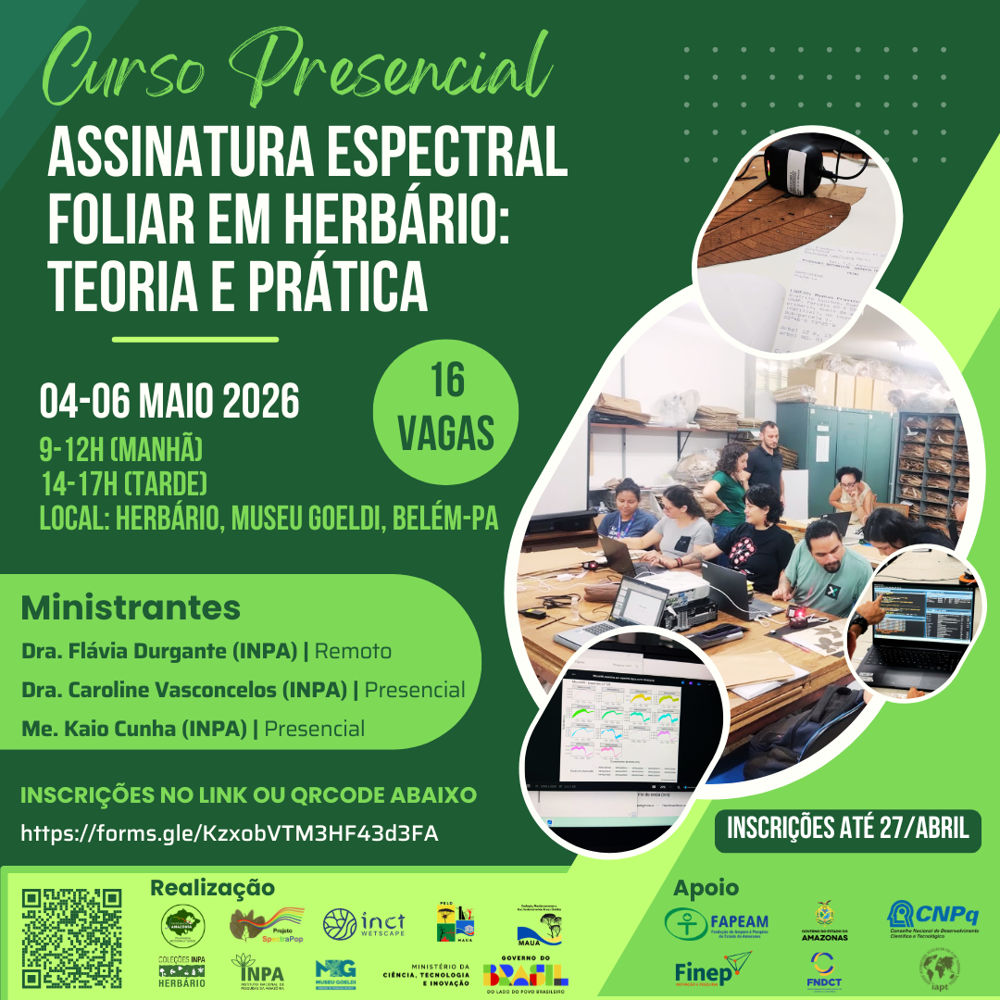
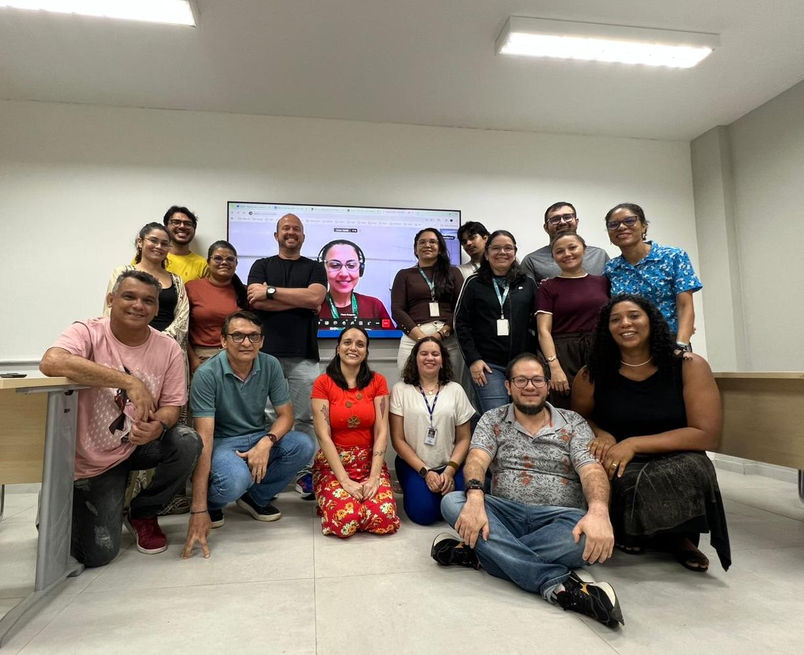

# Introduction

Welcome!😊

This course was developed within the
[HerbSpectra-Amazônia](https://linktr.ee/herbspectraamazonia) Project
(Call No. 03/2025 - Pró-Amazônia) to train students and professionals in
the use of the portable NIR spectrometer, covering everything from the
initial setup of the equipment to the analysis of spectral data.

Over three days of theoretical and practical activities, participants
will explore the fundamentals of near-infrared (NIR) spectroscopy and
its application to plant identification.

<figure style="text-align:center;">

{.slide style="display:block;"}

<figcaption style="font-size:0.9rem; color:#555; margin-top:6px;">

Promotional flyer for the course at the Herbarium of the Museu Paraense
Emílio Goeldi.

</figcaption>

</figure>

# Course details

**Where:** MG Herbarium, Research Campus - Museu Paraense Emílio Goeldi,
Av. Perimetral, 1901 - 66077-830 - Terra Firme, Belém, Pará, Brazil.

```{r echo=FALSE, message=FALSE, warning=FALSE}
library(leaflet)
leaflet() %>%
  addTiles %>% # Add default OpenStreetMap map tiles
  setView(lng = -48.443668, lat = -1.451330, zoom = 17)
```

**Date:** May 4–6, 2026.\

**Target audience:** Students and professionals involved in the
herbarium/reference collection workflow who are interested in using
portable spectroscopy for scientific research.\

**Number of places:** 16 (in-person places).\

**Course load:** 18 h (a certificate of participation will be issued).\

**Format:** In-person course, with theoretical classes streamed live in
a virtual environment and practical activities carried out in person.
Four laptops will be available for the practical activities, and
participants will be organized into four groups.

**Material:** The course material will be made available directly to
participants or via ⬇️ [Download](../download.qmd).

# Schedule

## Overview

The course activities will take place over three consecutive days, from
Monday to Wednesday.

Morning sessions will run from 8:30 am to 12:00 pm (local time in
Belém).

Afternoon sessions will run from 2:00 pm to 5:00 pm (local time in
Belém).

## Timeline

### Day 1 (Monday, May 4)

#### Morning (Flávia Durgante)

-   Theoretical fundamentals of NIR spectroscopy and its applications (part I)

▶️ Access to the class: <https://meet.jit.si/CursoGoeldi>

📚 Complementary material: Video – Tour of the Electromagnetic Spectrum
(NASA): <https://www.youtube.com/watch?v=2p7FPFvu_j0>

#### Afternoon (Caroline Vasconcelos, Kaio Cunha and Gabrielly Ribeiro)

-   Presentation of the NIR-S-G1 device (InnoSpectra Corp.) and
    accessories

-   Setting up the ISC-NIRScan GUI app (*laptop* and *smartphone*)

-   Introduction to the portable NIR workflow

### Day 2 (Tuesday, May 5)

#### Morning (Caroline Vasconcelos, Kaio Cunha and Gabrielly Ribeiro)

-   Practical exercise in acquiring spectra and metadata from herbarium specimens

-   The species listed [at this link](https://docs.google.com/spreadsheets/d/1nDfQMOe26fblt0OLafKL6Gx1h7syhyFjfGT0lVjOYj4/edit?usp=sharing) will be tested during the course.

#### Afternoon (Caroline Vasconcelos, Kaio Cunha and Gabrielly Ribeiro)

-   Practical exercise in acquiring spectra and metadata from herbarium specimens

### Day 3 (Wednesday, May 6)

#### Morning (Caroline Vasconcelos, Kaio Cunha and Gabrielly Ribeiro)

-   Practical exercise in acquiring spectra and metadata from herbarium specimens

#### Afternoon (Caroline Vasconcelos, Kaio Cunha, Gabrielly Ribeiro, Flávia Durgante)

-   In the R environment:
    -   Installing and loading the required libraries
    -   Importing spectral data
    -   Visualization: assessing spectra quality and PCA
    -   Preparing the data for analysis
    -   Discriminant analysis (LDA) with Leave-One-Out (LOO) cross-validation
    -   Performance evaluation (accuracy and confusion matrix)
    -   Interpreting the results

-   Final remarks on the course

▶️ Access to the class: <https://meet.jit.si/CursoGoeldi>

# Organizing and training team

 Prof. Dr. Flávia Durgante
(HerbSpectra-Amazônia Coordinator), MAUA/ATTO/INPA
<a href="http://lattes.cnpq.br/9866263113578229" target="_blank"></a>

 Dr. Caroline Vasconcelos
(HerbSpectra-Amazônia fellow), MAUA/INPA
<a href="http://lattes.cnpq.br/1535461703335857" target="_blank"></a>

 MSc Kaio Cunha (HerbSpectra-Amazônia fellow), MAUA/INPA
<a href="http://lattes.cnpq.br/2664299098538335" target="_blank"></a>

 MSc Gabrielly Guabiraba Ribeiro
(PhD student at PPGBOT), JBRJ
<a href="http://lattes.cnpq.br/4435352680317467" target="_blank"></a>

# Funding

This course is supported by the projects "Amazonian Spectral Herbaria
Network: Spectroscopy and artificial intelligence for the automated
identification of biodiversity in Amazonian herbaria -
HerbSpectra-Amazônia", funded by the National Council for Scientific and
Technological Development (CNPq), Public Call MCTI/CNPq No. 03/2025 -
Pró-Amazônia (process no. 385465/2025-4); "Building a near-infrared
spectral library to reveal new species of *Ecclinusa* (Sapotaceae,
Chrysophylloideae) in South America", funded by the International
Association for Plant Taxonomy (IAPT, 2025 round); and "Popularization
of the use of the Species Spectral Signature in the identification of
trees in Sustainable Forest Management in the Amazon - SPECTRA POP”,
funded by the Amazonas State Research Support Foundation (FAPEAM), Call
No. 006/2024 - Mulher Faz Ciência (Process No.
01.02.016301.04984/2024-17). The course is also supported by the INPA
Herbarium through the MCTI/FINEP/FNDCT Public Call No. 02/2016 –
National Multi-User Centers.

# Participants

<figure style="text-align:center;">



<figcaption style="font-size:0.9rem; color:#555; margin-top:6px;">

Participants of the 5th SpectraPop Project Course and 1st HerbSpectra-Amazônia Project Course, Emílio Goeldi Herbarium, May 2026.

</figcaption>

</figure>


# Certificates

To generate your certificate, fill in the form:

🔗 <https://forms.gle/3R5HoPVWErxvzQDY8>

Certificates can be accessed at the link below. Look for your name in the file list and use the first three digits of your CPF (Brazilian taxpayer ID number) to open the corresponding certificate.

📂 [Access certificates](https://drive.google.com/drive/folders/1wdWcgZcYjocJ5Nymd0UqMQvTZX7CJl_x?usp=sharing)
