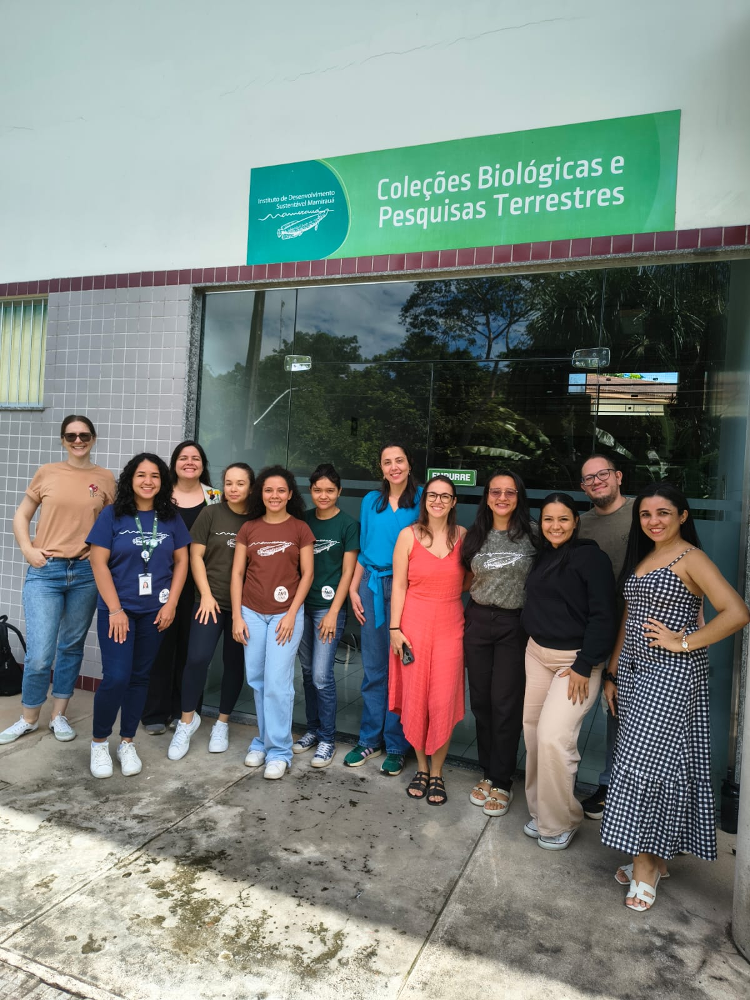

# Introduction

Welcome!😊

This course was designed to train students and professionals in the use of the portable spectrometer, covering everything from the initial setup of the equipment to the analysis of spectral data.

Over three days of theoretical and practical activities, participants will explore the fundamentals of near-infrared (NIR) spectroscopy and its application to plant identification.

In addition, the course seeks to identify practical challenges in the use of the equipment, contributing to the development of a standardized application protocol within the [SpectraPop Project](../index.qmd).

# Course details

**Where:** Auditorium, Mamirauá Institute for Sustainable Development, Estrada do Bexiga, 2584 - 69553-225 - Fonte Boa, Tefé, Amazonas, Brazil.

```{r echo=FALSE, message=FALSE, warning=FALSE}
library(leaflet)
leaflet() %>%
  addTiles %>% # Add default OpenStreetMap map tiles
  setView(lng = -64.731643, lat = -3.352820, zoom = 17)
```

**Date:** June 9–11, 2026.\

**Target audience:** Students and professionals involved in the herbarium/reference collection workflow who are interested in using portable spectroscopy for scientific research.\

**Number of places:** 16 (in-person places).\

**Course load:** 18 h (a certificate of participation will be issued).\

**Format:** In-person course, with theoretical classes and practical activities. Four laptops will be available for the practical activities, and participants will be organized into four groups.

**Material:** The course material will be made available directly to participants or via ⬇️ [Download](../download.qmd).

# Schedule

## Overview

The course activities will take place over three consecutive days, from Tuesday to Thursday.

Morning sessions will run from 9:00 am to 12:00 pm (Amazonas standard time).

Afternoon sessions will run from 2:00 pm to 5:00 pm (Amazonas standard time).

## Timeline

### Day 1 (Tuesday, June 9)

#### Morning

-   Theoretical fundamentals of NIR spectroscopy and its applications - part I

📚 Complementary material: Video – Tour of the Electromagnetic Spectrum (NASA): <https://www.youtube.com/watch?v=2p7FPFvu_j0>

#### Afternoon

-   Presentation of the NIR-S-G1 device (InnoSpectra Corp.) and
    accessories

-   Setting up the ISC-NIRScan GUI app

-   Introduction to the portable NIR workflow

### Day 2 (Wednesday, June 10)

#### Morning

-   Practical exercise in acquiring spectra and metadata from herbarium specimens

-   The species listed [at this link](https://docs.google.com/spreadsheets/d/1nDfQMOe26fblt0OLafKL6Gx1h7syhyFjfGT0lVjOYj4/edit?usp=sharing) will be tested during the course.

#### Afternoon

-   Practical exercise in acquiring spectra and metadata from herbarium specimens

### Day 3 (Thursday, June 11)

#### Morning

-   Theoretical fundamentals of NIR spectroscopy and its applications - part II

#### Afternoon

-   In the R environment:
    -   Installing and loading the required libraries
    -   Importing spectral data
    -   Visualization: assessing spectra quality and PCA
    -   Preparing the data for analysis
    -   Discriminant analysis (LDA) with Leave-One-Out (LOO) cross-validation
    -   Performance evaluation (accuracy and confusion matrix)
    -   Interpreting the results

-   Final remarks on the course

# Organizing and training team

 Prof. Dr. Flávia Durgante (Coordinator of the SpectraPop/HerbSpectra-Amazônia Projects), MAUA/ATTO/INPA <a href="http://lattes.cnpq.br/9866263113578229" target="_blank"></a>

 Dr. Samyra Ramos (HerbSpectra-Amazônia Project fellow), MAUA/INPA <a href="http://lattes.cnpq.br/1333559162162849" target="_blank"></a>

 MSc Kaio Cunha (HerbSpectra-Amazônia Project fellow), MAUA/INPA <a href="http://lattes.cnpq.br/2664299098538335" target="_blank"></a>

 Dr. Kelly Torralvo (SpectraPop Project collaborator), IDSM <a href="http://lattes.cnpq.br/8990804799144033" target="_blank"></a>

 Dr. Darlene Gris (SpectraPop Project collaborator), IDSM <a href="http://lattes.cnpq.br/9797541704067903" target="_blank"></a>

# Funding

This course is supported by the projects "Amazonian Spectral Herbaria Network: Spectroscopy and artificial intelligence for the automated identification of biodiversity in Amazonian herbaria - HerbSpectra-Amazônia", funded by the National Council for Scientific and Technological Development (CNPq), Public Call MCTI/CNPq No. 03/2025 - Pró-Amazônia (process no. 385465/2025-4); and "Popularization of the use of the Species Spectral Signature in the identification of trees in Sustainable Forest Management in the Amazon - SPECTRA POP”, funded by the Amazonas State Research Support Foundation (FAPEAM), Call No. 006/2024 - Mulher Faz Ciência (Process No. 01.02.016301.04984/2024-17). The course is also supported by the INPA Herbarium through the MCTI/FINEP/FNDCT Public Call No. 02/2016 – National Multi-User Centers.

# Participants

<figure style="text-align:center;">



<figcaption style="font-size:0.9rem; color:#555; margin-top:6px;">

Participants of the 6th SpectraPop Project Course, Mamirauá Institute for Sustainable Development, Tefé, AM. June 2026.

</figcaption>

</figure>

# Certificates

To generate your certificate, fill in the form: <https://forms.gle/TMPSEC3PMazXsBUs6>
