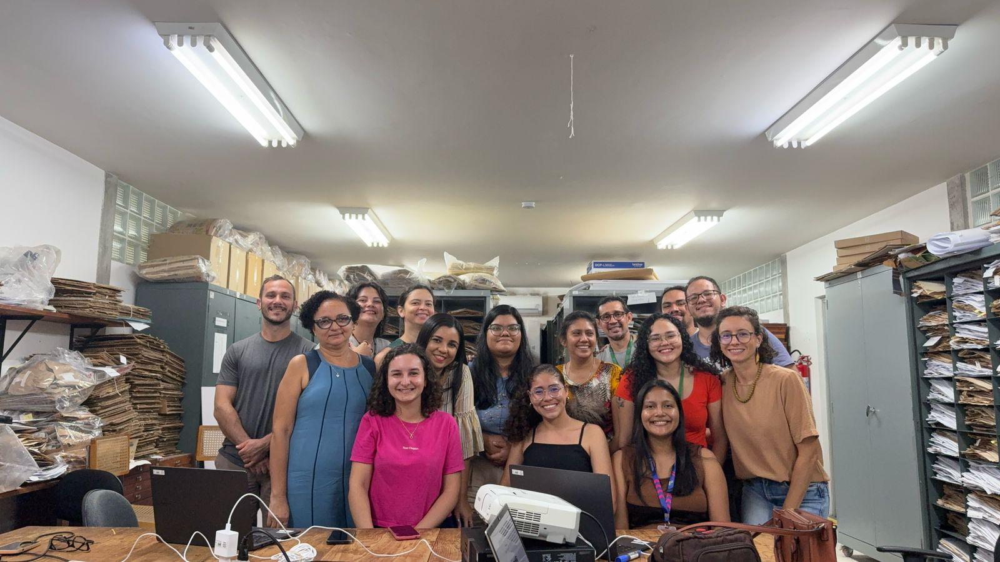
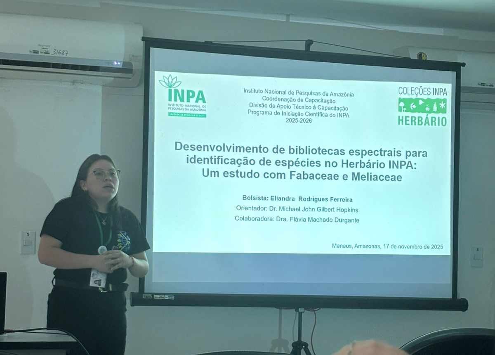
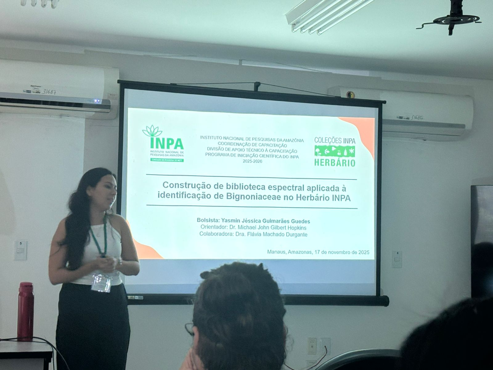
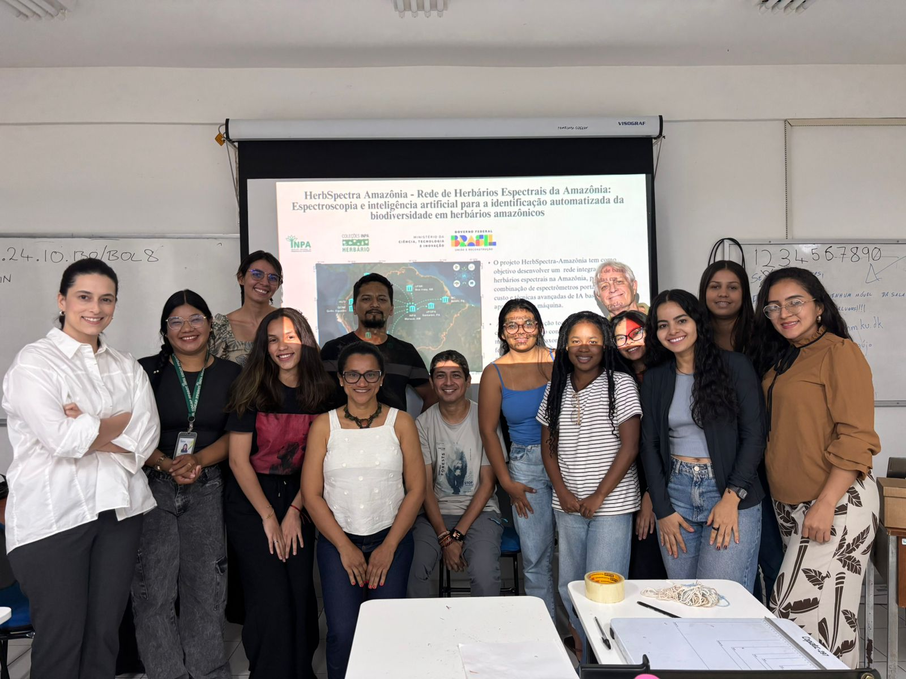

::: scroll-container
<figure>

<figcaption>1st SpectraPop Course class. Apr 2025</figcaption>

</figure>

<figure>

<figcaption>Participants of the IHerbSpec inaugural workshop. May 2025.</figcaption>

</figure>

<figure>

<figcaption>Flávia Durgante giving a talk at Harvard. May 2025</figcaption>

</figure>

<figure>

<figcaption>Mike Hopkins and Flávia Durgante at Harvard. May 2025</figcaption>

</figure>

<figure>

<figcaption>Flávia Durgante at CNBot. Aug 2025</figcaption>

</figure>

<figure>

<figcaption>SpectraPop at CNBot. Aug 2025</figcaption>

</figure>

<figure>

<figcaption>Flávia Durgante at PPGBot-INPA. Aug 2025</figcaption>

</figure>

<figure>

<figcaption>Spectroscopy course at PPGBot-INPA. Aug 2025</figcaption>

</figure>

<figure>

<figcaption>Undergraduate research fellows working at the INPA Herbarium. Sep 2025</figcaption>

</figure>

<figure>

<figcaption>Undergraduate research fellows working at the INPA Herbarium. Sep 2025</figcaption>

</figure>

<figure>

<figcaption>Undergraduate research fellows working at the INPA Herbarium. Sep 2025</figcaption>

</figure>

<figure></figure>

<figure>

<figcaption>INPA Herbarium team at INPA's National Science and Technology Week. Oct 2025</figcaption>

</figure>

<figure>

<figcaption>Undergraduate research fellows presenting their projects at INPA. Nov 2025</figcaption>

</figure>

<figure>

<figcaption>Undergraduate research fellows presenting their projects at INPA. Nov 2025</figcaption>

</figure>

<figure>

<figcaption>Undergraduate research fellows presenting their projects at INPA. Nov 2025</figcaption>

</figure>

<figure>

<figcaption>2nd SpectraPop Course class. Dec 2025</figcaption>

</figure>

<figure>

<figcaption>Hands-on session at the 2nd SpectraPop Course. Dec 2025</figcaption>

</figure>

<figure>

<figcaption>Hands-on session at the 2nd SpectraPop Course</figcaption>

</figure>

<figure>

<figcaption>Hands-on session at the 2nd SpectraPop Course</figcaption>

</figure>

<figure>

<figcaption>Hands-on session at the 2nd SpectraPop Course</figcaption>

</figure>

<figure>

<figcaption>Paulo Boca class during the course held at the ATTO site. Mar 2026</figcaption>

</figure>

<figure>

<figcaption>PPGBOT master's students learning about spectral studies. Mar 2026</figcaption>

</figure>

<figure>

<figcaption>Short course at the 4th ERBOT Norte. Belém, PA. Apr 2026</figcaption>

</figure>

<figure>

<figcaption>Visit to the IAN Herbarium. Belém, PA. Apr 2026</figcaption>

</figure>

<figure>

<figcaption>4th ERBOT Norte. Belém, PA. Apr 2026</figcaption>

</figure>

<figure>

<figcaption>4th ERBOT Norte. Belém, PA. Apr 2026</figcaption>

</figure>

<figure>

<figcaption>1st HerbSpectra Course at MPEG. Belém, PA. May 2026</figcaption>

</figure>

<figure>

<figcaption>Visit to the MG Herbarium. Belém, PA. May 2026</figcaption>

</figure>

<figure>

<figcaption>Visit to the MG Herbarium. Belém, PA. May 2026</figcaption>

</figure>

<figure>

<figcaption>1st HerbSpectra Course at MPEG. Belém, PA. May 2026</figcaption>

</figure>

<figure>

<figcaption>1st HerbSpectra Course at MPEG. Belém, PA. May 2026</figcaption>

</figure>

<figure></figure>

<figure>

<figcaption>1st HerbSpectra Course at MPEG. Belém, PA. May 2026</figcaption>

</figure>

<figure>

<figcaption>IHerbSpec Research Symposium and Meeting. Missouri Botanical Garden. May 19-20, 2026</figcaption>

</figure>

<figure>

<figcaption>Course in Tefé, AM. Jun 2026</figcaption>

</figure>

<figure>

<figcaption>Course in Tefé, AM. Jun 2026</figcaption>

</figure>

<figure>

<figcaption>SpectraPop team at the CFBBA Workshop. INPA, Manaus. Jun 2026</figcaption>

</figure>

<figure>

<figcaption>CFBBA Workshop participants. INPA, Manaus. Jun 2026</figcaption>

</figure>
:::
