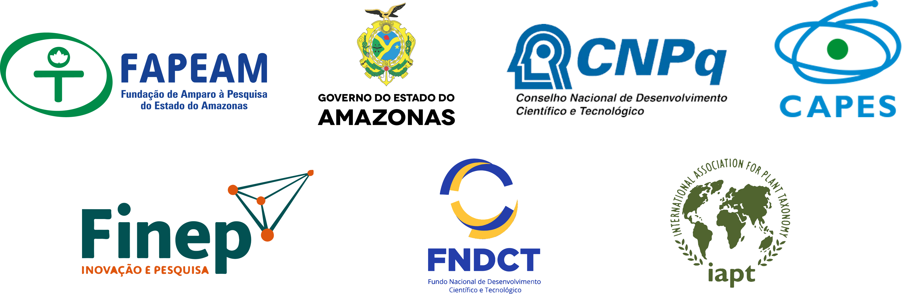
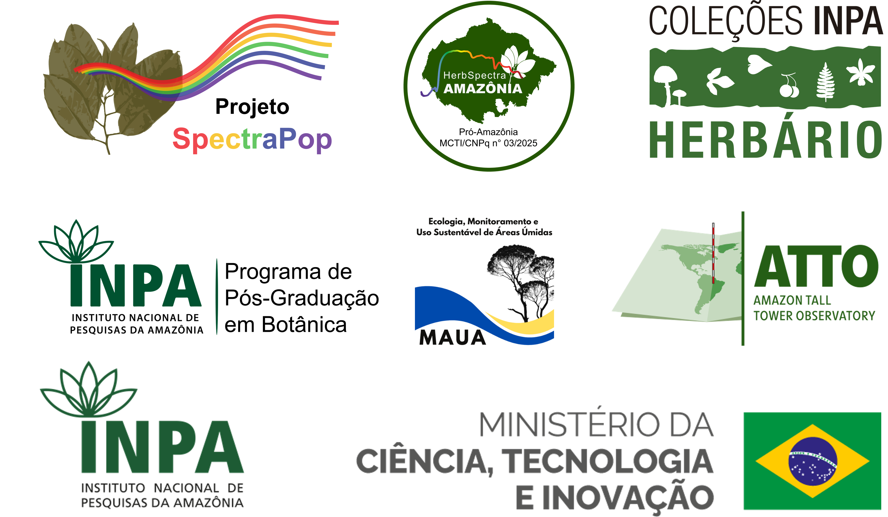
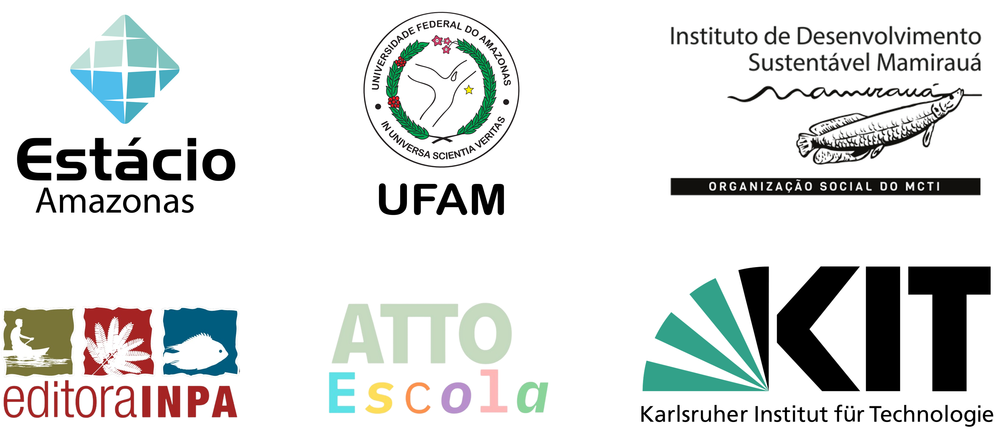

# Abstract

Errors in the identification of timber species affect the entire forest management production chain, from the sustainability of managing high-value commercial species for future harvest cycles to inspection and the sale and trade of timber. Thus, seeking to improve the species identification process for sustainable forest management, this proposal aims to develop and popularize the use of species spectral signatures in the identification of species of high commercial value. The combined use of high-technology instruments and appropriate techniques to discriminate tree species is necessary to improve biodiversity inventory systems in tropical countries. Near-infrared leaf spectroscopy has shown promise for discriminating plant species. We therefore intend to build a spectral herbarium, use protocols, test more accessible equipment, and train people from different groups in society. In this way, we believe in popularizing the use of this tool, developed at the National Institute for Amazonian Research (INPA), to improve the quality of identifications in forest management in the Amazon. The popularization and application of this tool will increase the sustainability of forest management in the state of Amazonas. Thus, this project aims to develop and popularize a technology that will benefit Amazonas environmentally, socially and economically.

# General objective

To develop and popularize the spectral herbarium (near-infrared spectroscopy) of timber and non-timber species of high commercial value, for application in sustainable forest management in the state of Amazonas.

# Team members

## Coordination

 **Flávia M. Durgante** (MAUA/ATTO/INPA) 

## Collaborating researchers

 **Florian Wittmann** (KIT/MAUA/ATTO) 

 **Jochen Schöngart** (MAUA/ATTO/INPA) 

 **Maria T. F. Piedade** (MAUA/ATTO/INPA) 

 **Layon O. Demarchi** (MAUA/INPA) 

 **Alberto Vicentini** (INPA) 

 **Michael J. G. Hopkins** (INPA) 

 **Kelly C. Torralvo** (IDSM) 

 **Rafael M. Rabelo** (IDSM) 

 **Darlene Gris** (IDSM) 

 **Caroline C. Vasconcelos** (UFAM) 

 **Caroline L. Mallmann** (UFSM/MAUA/INPA) 

## Fellows

 **Samyra Ramos Chaves** (MAUA/INPA) - PhD - CNPq DTI-A fellow 

 **Hilana L. Hadlich** (MAUA/INPA) - PhD - CNPq DTI-B fellow 

 **Kaio Cesar M. da Cunha** (MAUA/INPA) - MSc - CNPq DTI-B fellow 

 **Túlio Alex Martins da Silva** (MAUA/INPA) - PhD student - CAPES fellow 

 **Maria Clara A. M. O. Ramos Ferro** (MAUA/INPA) - MSc student - CAPES fellow 

 **Cassia Sousa Ataide** (UFAM/INPA Herbarium) - Undergraduate - CNPq PIBIC fellow 

 **Yasmin Jéssica G. Guedes** (UFAM/INPA Herbarium) - Undergraduate - CNPq PIBIC fellow 

### Alumni

 **Eliandra Rodrigues Ferreira** (Estácio/INPA Herbarium) - Undergraduate - CNPq PIBIC fellow 

 **Eduardo Leandro Cunha** (UFAM/INPA Herbarium) - Undergraduate - CNPq PIBIC fellow 

# Courses offered

 **1st Course:** April 2–4, 2025 (INPA, Manaus, AM)

 **2nd Course:** December 17–19, 2025 (INPA, Manaus, AM)

 **3rd Course:** March 23–30, 2026 (ATTO Site, São Sebastião do Uatumã, AM)

 **4th Course (ERBOT Norte):** April 26, 2026 (ICB/UFPA, Belém, PA)

 **5th Course:** May 4–6, 2026 (Herbarium/Goeldi Museum, Belém, PA)

 **6th Course:** June 9–11, 2026 (Herbarium/Mamirauá Institute, Tefé, AM)

# Funders

The SPECTRA POP project is funded by the Amazonas State Research Support Foundation (FAPEAM), Call No. 006/2024 - Mulher Faz Ciência (Process No. 01.02.016301.04984/2024-17), and supported by the INPA Herbarium through the MCTI/FINEP/FNDCT Public Call No. 02/2016 – National Multi-User Centers.

# Organized by

# Partners

