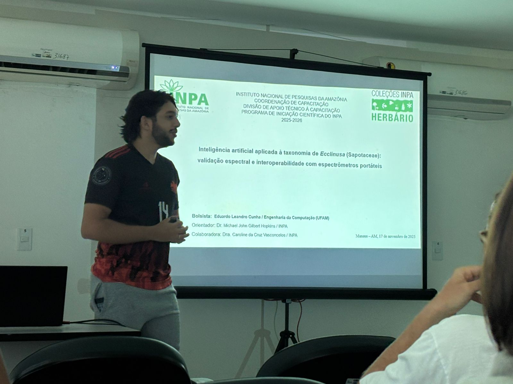

During the week of November 17, 2025, the National Institute for Amazonian Research ([INPA](https://www.gov.br/inpa/pt-br)) hosted the interim presentations session of the CNPq/INPA Institutional Program of Undergraduate Research Scholarships in Technological Development and Innovation ([PIBIC](https://www.gov.br/inpa/pt-br/assuntos/capacitacao/iniciacao-cientifica)), with the enthusiastic participation of our students in the field of Botany.

PIBIC/INPA aims to encourage higher-education students in the activities, methodologies, knowledge and practices of technological development and innovation processes. The target audience is undergraduate students regularly enrolled in public and private higher-education institutions, in programs compatible with the areas covered by the program, such as:

-   Strategic Technologies, in the following sectors: Space, Nuclear, Cybernetics, and Public and Border Security
-   Enabling Technologies, in the following sectors: Artificial Intelligence, Internet of Things, Advanced Materials, Biotechnology and Nanotechnology.
-   Production Technologies, in the following sectors: Industry, Agribusiness, Communications, Infrastructure and Services.
-   Technologies for Sustainable Development, in the following sectors: Smart and Sustainable Cities, Renewable Energy, Bioeconomy, Solid Waste Treatment and Recycling, Pollution Treatment, Monitoring, prevention and recovery from natural and environmental disasters, and Environmental Preservation.
-   Technologies for Quality of Life, in the following sectors: Health, Basic Sanitation, Water Security and Assistive Technologies.

Maintained by the Training Coordination office, PIBIC is a partnership between INPA and the National Council for Scientific and Technological Development ([CNPq](https://www.gov.br/cnpq/pt-br)), which grants the research scholarships.

------------------------------------------------------------------------

# Eduardo Leandro Cunha

<figure>

<figcaption style="font-size: 0.8em;">

Photo by Maria Clara Ferro (2025).

</figcaption>

</figure>

**Institution:** Federal University of Amazonas (UFAM)

**Program:** Computer Engineering

**Semester:** 6th

**Lattes:** <http://lattes.cnpq.br/2142166621987119>

**Project developed at INPA:** Artificial intelligence applied to the taxonomy of *Ecclinusa* (Sapotaceae): spectral validation and interoperability with portable spectrometers

**Advisor:** Dr. Michael Hopkins

**Co-advisor:** Dr. Caroline Vasconcelos

**Collaborators:** Dr. Flávia Durgante, Dr. Samyra Ramos and Maria Clara Ferro

Eduardo's work investigates how leaf spectral signatures (obtained from INPA Herbarium specimens) can help identify species of the genus *Ecclinusa*, a challenging group within the family Sapotaceae. The focus of the project is to test whether portable spectrometers, such as the ISC NIR-S-G1 (MicroNIR), can reproduce with good accuracy the results of high-resolution equipment such as the ASD FieldSpec 4. In this way, the project helps make spectroscopy more accessible to tropical herbaria, strengthens the use of the technology at INPA and expands our spectral libraries.

------------------------------------------------------------------------

# Eliandra Rodrigues Ferreira

<figure>

<figcaption style="font-size: 0.8em;">

Photo by Jéssica Soares (2025).

</figcaption>

</figure>

**Institution:** Estácio do Amazonas

**Program:** Bachelor's degree in Biological Sciences

**Semester:** 6th

**Lattes:** <https://lattes.cnpq.br/3358526069960413>

**Project developed at INPA:** Development of spectral libraries for species identification at the INPA Herbarium: a study with Fabaceae and Meliaceae

**Advisor:** Dr. Michael Hopkins

**Co-advisor:** Dr. Flávia Durgante

**Collaborators:** Dr. Caroline Vasconcelos, Dr. Samyra Ramos and Maria Clara Ferro

Eliandra's research focuses on two families of great ecological and economic importance (Fabaceae and Meliaceae), including CITES-listed species such as *Dipteryx* (popularly known as cumaru) and *Cedrela* (cedar). Using reflectance spectroscopy on herbarium specimens, she is building a robust spectral library that will make it possible to quickly identify threatened species and support enforcement and the taxonomic curation of the herbarium.

------------------------------------------------------------------------

# Yasmin Jéssica Guimarães Guedes

<figure>

<figcaption style="font-size: 0.8em;">

Photo by Maria Clara Ferro (2025).

</figcaption>

</figure>

**Institution:** Federal University of Amazonas (UFAM)

**Program:** Teaching degree in Biology (Licenciatura)

**Semester:** 6th

**Lattes:** <https://lattes.cnpq.br/7129000327997949>

**Project developed at INPA:** Building a spectral library applied to the identification of Bignoniaceae at the INPA Herbarium

**Advisor:** Dr. Michael Hopkins

**Co-advisor:** Dr. Flávia Durgante

**Collaborators:** Dr. Caroline Vasconcelos, Dr. Samyra Ramos and Maria Clara Ferro

Yasmin works with Bignoniaceae, an emblematic family of the South American flora that also includes species protected by CITES. Her goal is to develop a spectral library capable of distinguishing species of *Handroanthus* and *Tabebuia*, groups of high timber value and frequent taxonomic confusion. The project reinforces the role of herbaria in identifying threatened species and opens the door to the use of spectroscopy as an environmental monitoring tool.

------------------------------------------------------------------------

Finally, it is a privilege to follow the training of these new researchers and to see how emerging technologies — such as reflectance spectroscopy, machine learning and digital libraries — are transforming the way we investigate, curate and understand Amazonian biodiversity.

Congratulations to the students on their presentations and their commitment to science produced in the Amazon! 👏
