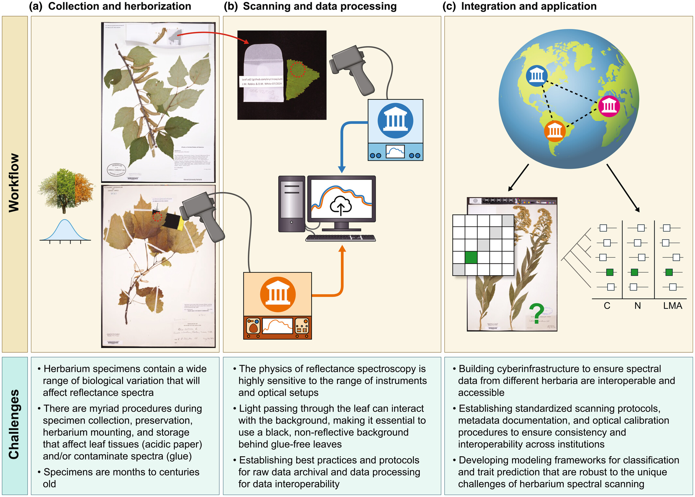
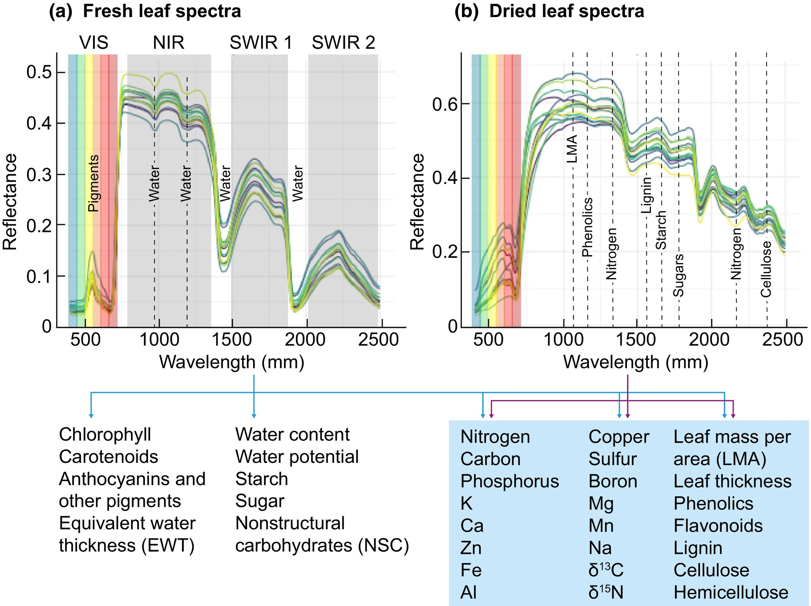

The study, entitled **"Next-generation specimen digitization: capturing reflectance spectra from the world’s herbaria for modeling plant biology across time, space, and taxa"**, has just been published in the high-impact journal *New Phytologist* and brings together researchers from institutions around the world — including Flávia Durgante, Michael (Mike) Hopkins and Caroline Vasconcelos, co-authors of the work and members of the SpectraPop project.

<figure>

<figcaption style="font-size: 0.8em;">

Herbarium spectral digitization workflow, from specimen collection to global integration, and challenges. © New Phytologist.

</figcaption>

</figure>

------------------------------------------------------------------------

# What are reflectance spectra and why do they matter?

Spectral reflectance measures how leaves and other plant tissues reflect light across different wavelengths (from the visible to the infrared). These "spectral signatures" carry valuable information about chemical composition, structure, functional traits and even the taxonomic identity of plants.

<figure>

<figcaption style="font-size: 0.8em;">

Herbarium spectral digitization workflow, from specimen collection to global integration, and challenges. © New Phytologist.

</figcaption>

</figure>

In recent years, spectroscopy has proven to be a powerful tool for:

-   Estimating plant functional traits (such as nitrogen, carbon and lignin);
-   Distinguishing morphologically similar species;
-   Investigating evolutionary and ecological patterns;
-   Connecting herbarium data with remote sensing and global ecological models.

# Herbaria of the future

The article expands the concept of the "extended specimen", proposing that herbaria — which already hold morphological, geographic and temporal information — also begin to incorporate standardized spectral data. With about 400 million specimens preserved worldwide, herbaria represent a unique opportunity to reconstruct plant phenotypic variation over time, across space and among evolutionary lineages.

Even dried and pressed leaves, some decades or centuries old, can provide reliable spectra for many types of analyses, from taxonomy to functional ecology.

# A global effort: IHerbSpec

The work presents and discusses the foundations of [IHerbSpec](https://iherbspec.github.io/) (International Herbarium Spectral Digitization), an international group created to:

-   Establish protocols and standards for spectral data collection in herbaria;
-   Ensure that data are FAIR (Findable, Accessible, Interoperable and Reusable);
-   Promote ethical, equitable and global spectral digitization, with special attention to historically under-sampled tropical regions.

# Where does SpectraPop come in?

SpectraPop, supported by FAPEAM, is directly aligned with this vision. The project bets on the visualization, integration and communication of spectral data, bringing science, herbaria and society closer together. By contributing to this global debate, we reinforce the role of spectroscopy as a bridge between historical collections and major contemporary challenges, such as climate change, biodiversity loss and conservation.

The participation of researchers linked to SpectraPop in this article highlights the project's relevance in the international scientific scene and reaffirms our commitment to open science, methodological innovation and the social return of knowledge.

🔗 Want to know more? Access the full article here: 

  <a href="https://doi.org/10.1111/nph.70645" class="doi-badge" target="_blank">
    DOI
    10.1111/nph.70645
  </a>

Keep an eye on the SpectraPop blog for more news about spectroscopy, herbaria and biodiversity!
