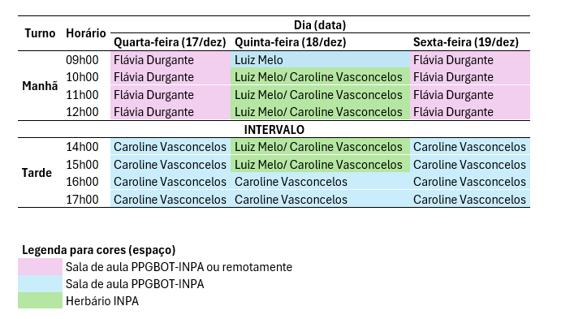
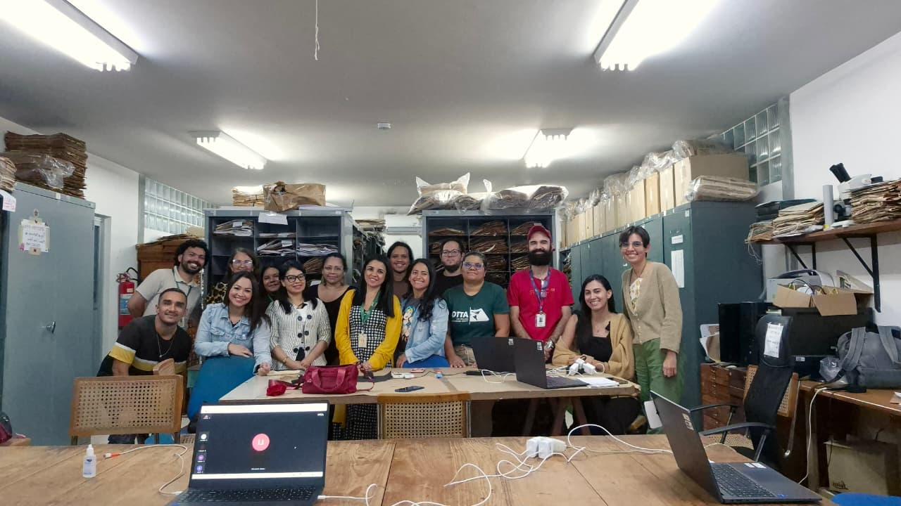

# Presentación

¡Sean bienvenidos(as)!😊

Este curso fue desarrollado para capacitar a estudiantes y profesionales en el uso del espectrómetro portátil MicroNIR, abarcando desde la configuración inicial del equipo hasta el análisis de los datos espectrales.

A lo largo de tres días de actividades teóricas y prácticas, los participantes explorarán los fundamentos de la espectroscopía en el infrarrojo cercano (NIR) y su aplicación en la identificación de plantas.

Además, el curso busca identificar desafíos prácticos en el uso del equipo, contribuyendo al desarrollo de un protocolo estandarizado de aplicación en el marco del [Proyecto SpectraPop](../index.qmd).

# Detalles del curso

**Dónde:** Aula del PPG-Botánica y Herbario INPA, Instituto Nacional de Investigaciones de la Amazonía (INPA, campus I), Av. André Araújo, 2.936 - 69067-375 - Petrópolis, Manaus, Amazonas, Brasil.

```{r echo=FALSE, message=FALSE, warning=FALSE}
library(leaflet)
leaflet() %>%
  addTiles %>% # Add default OpenStreetMap map tiles
  setView(lng = -59.98748286262644, lat = -3.0950992004397473, zoom = 17)
```

**Fecha:** Del 17 al 19 de diciembre de 2025.\

**Público objetivo:** Estudiantes y profesionales involucrados en el flujo de trabajo de herbarios/colecciones de referencia que tengan interés en el uso de la espectroscopía portátil para la investigación científica.\

**Número de cupos:** 20 (cupos presenciales).\

**Carga horaria:** 18 h (con emisión de certificado de participación).\

**Formato:** Híbrido, con clases teóricas impartidas en un entorno virtual, con opción de participación presencial en el aula del INPA, y clases prácticas exclusivamente presenciales. Para las actividades prácticas habrá cuatro *laptops* disponibles y los participantes se organizarán en cuatro grupos.

**Material:** Las diapositivas, los *scripts* y los datos obtenidos durante el curso se pondrán a disposición directamente de los alumnos o a través de [GitHub](https://github.com/ccvasconcelos/spectrapop).

**Observaciones importantes:**

-   Los participantes externos deben presentar un documento de identidad con foto (p. ej., cédula de identidad o documento nacional) e informar en cualquier portería del INPA que están [participando en una capacitación en el Herbario INPA]{.underline}.

-   Al finalizar el curso, cada participante debe responder un formulario de aprovechamiento para evaluar la capacitación y aportar sugerencias para mejorar el protocolo de uso del MicroNIR, que en el futuro se pondrá a disposición de toda la comunidad interesada.

# Cronograma

## Visión general

Las actividades del curso se realizarán durante tres días consecutivos, de miércoles a viernes.

Las sesiones de la mañana serán de 09:00 a 12:00 (hora estándar de Amazonas).

Las sesiones de la tarde serán de 14:00 a 17:00 (hora estándar de Amazonas).

## Línea de tiempo

### Día 1 (miércoles, 17/dic)

#### Mañana (Flávia)

Fundamentos teóricos de la espectroscopía NIR y sus aplicaciones

Enlace para acceder a la clase: <https://meet.jit.si/CursoSpectraPop>

Enlace para acceder a la lista de asistencia: <https://forms.gle/a2zAf1EhNPwFJcek6>

Video: Tour del Espectro Electromagnético (NASA): <https://www.youtube.com/watch?v=2p7FPFvu_j0>

#### Tarde (Caroline)

-   Presentación del dispositivo NIR-S-G1 (MicroNIR, InnoSpectra Corp.) y accesorios

-   Configuración de la aplicación ISC-NIRScan GUI (*laptop* y *smartphone*)

-   Calibración, recolección de datos espectrales y cuidados necesarios en la obtención de los espectros

-   Comprensión de los archivos de salida

Enlace para acceder a la lista de asistencia: <https://forms.gle/UUx6esK5UtvfUoNs5>

### Día 2 (jueves, 18/dic)

#### Mañana (Luiz y Caroline)

Operaciones con el MicroNIR y ejercicio práctico de adquisición de espectros.

Obtención de los metadatos asociados a los ejemplares de herbario.

Enlace para acceder a la lista de asistencia: <https://forms.gle/fWo12i6eGNRvphZ38>

#### Tarde (Caroline)

-   Instalación de las bibliotecas necesarias

-   Cómo importar las lecturas espectrales a R

-   Cómo visualizar espectros y evaluar la calidad de los datos espectrales

-   Cómo preparar los conjuntos de datos para el análisis

Enlace para acceder a la lista de asistencia: <https://forms.gle/6rTMCeVAexLfMfeN8>

### Día 3 (viernes, 19/dic)

#### Mañana (Flávia)

Fundamentos teóricos de la espectroscopía NIR y sus aplicaciones

Enlace para acceder a la clase: <https://meet.jit.si/CursoSpectraPop>

Enlace para acceder a la lista de asistencia: <https://forms.gle/TzM6XT7Y8AfPhQ8F7>

#### Tarde (Caroline)

-   Análisis discriminante (LDA) con validación cruzada *Leave-One-Out* (LOO)

-   Evaluación básica de los modelos (exactitud y matriz de confusión)

-   Responder el formulario de aprovechamiento del curso

Enlace para acceder a la lista de asistencia: <https://forms.gle/metm2uActUHtmSZr7>

Enlace para acceder al formulario de retroalimentación: <https://forms.gle/GPvYc9k3WZgeBdXX8>



# Equipo de organización y capacitación

 Profa. Dra. Flávia Durgante (Coordinadora del Proyecto SpectraPop), KIT/INPA/MAUA/ATTO <a href="http://lattes.cnpq.br/9866263113578229" target="_blank"></a>

 Dra. Caroline Vasconcelos (Becaria del Proyecto SpectraPop), INPA <a href="http://lattes.cnpq.br/1535461703335857" target="_blank"></a>

 Prof. Dr. Michael Hopkins (Colaborador), Curaduría del Herbario INPA <a href="http://lattes.cnpq.br/5738793047673962" target="_blank"></a>

 Dra. Samyra Ramos (Colaboradora), INPA <a href="http://lattes.cnpq.br/1333559162162849" target="_blank"></a>

 Mg. Kaio Cunha (Colaborador), INPA <a href="http://lattes.cnpq.br/2664299098538335" target="_blank"></a>

 Mg. Luiz Melo (Colaborador), INPA <a href="http://lattes.cnpq.br/0848738423393318" target="_blank"></a>

# Financiamiento

Este curso forma parte del Proyecto “Popularización del uso de la Firma Espectral de la Especie en la identificación de los árboles del Manejo Forestal Sostenible en la Amazonía - SPECTRA POP”, financiado por la Fundación de Apoyo a la Investigación del Estado de Amazonas (FAPEAM), Convocatoria n.º 006/2024 - Mulher Faz Ciência (Proceso n.º 01.02.016301.04984/2024-17), y cuenta con el apoyo del Herbario INPA a través de la Convocatoria pública MCTI/FINEP/FNDCT n.º 02/2016 – Centros Nacionales Multiusuarios.

# Participantes

<figure style="text-align:center;">

{.slide style="display:block;"}

<figcaption style="font-size:0.9rem; color:#555; margin-top:6px;">

Participantes del 2.º Curso del Proyecto SpectraPop, Herbario INPA, diciembre de 2025.

</figcaption>

</figure>

# Certificados

Para generar su certificado, complete el formulario: <https://forms.gle/XGg3XCmdMGUPxqCq9>
